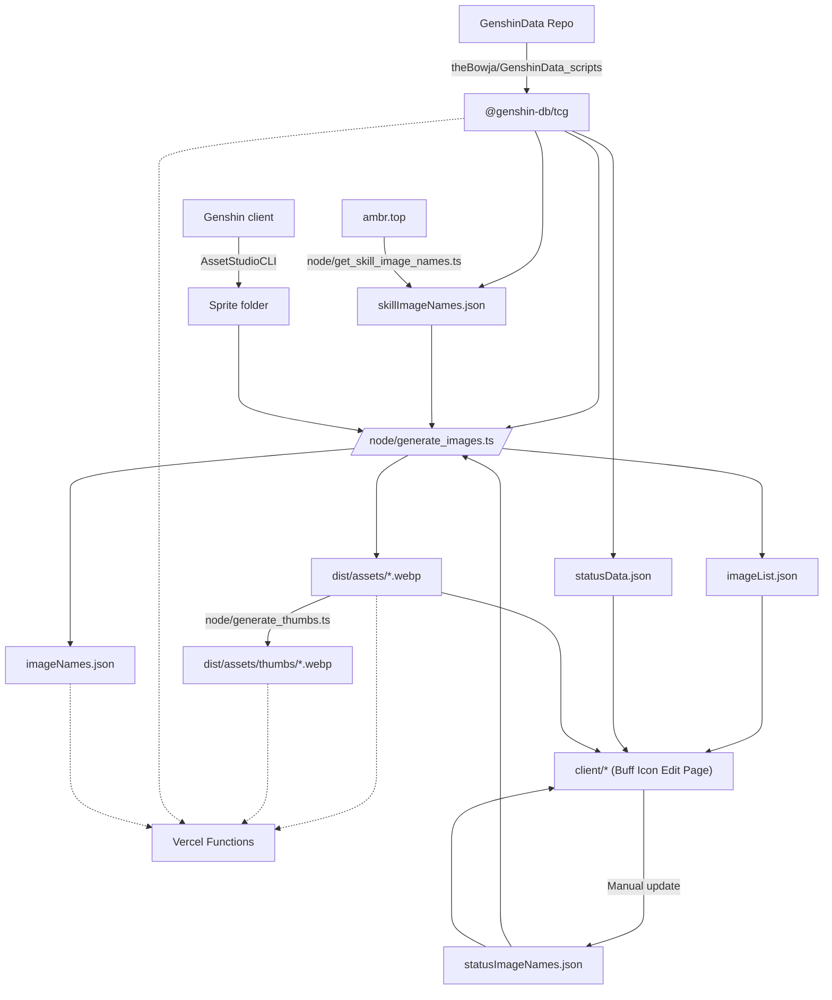

# gi-tcg-assets

此仓库存放用于生成七圣召唤模拟器静态资产的代码。资产产生路径如下：



其中 [AssetStudio](https://github.com/yarik0chka/YarikStudio) 的命令为：

> 编译前设置 `AssetStudio.CLI/App.config` 的 `allowDuplicates` 为 `True`

```
.\AssetStudio.CLI.exe --silent "D:\Genshin Impact Game\YuanShen_Data\StreamingAssets\AssetBundles\blocks" "D:\gi-assets"  --types Sprite --game GI --names "^UI_Gcg_(Buff|Cardface|Debuff)|^Skill_|^MonsterSkill_"
```
